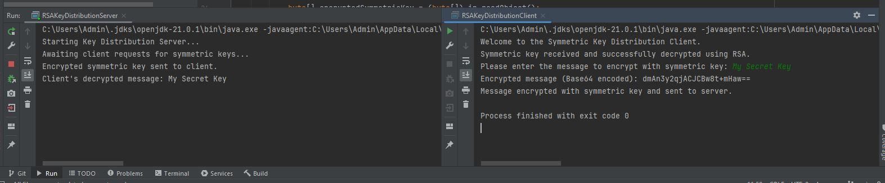

# Symmetric Key Distribution Using RSA Encrypted Keys Console Application

This project implements a simple RSA key distribution system that uses both RSA and AES encryption algorithms. It consists of a server that distributes RSA public keys and encrypted AES keys to clients, and clients that use these keys to securely communicate messages.
## Getting Started 
These instructions will help you get a copy of the project up and running on your local machine for development and testing purposes.
### Prerequisites
  - Java installed on your system
  
### Installing
  - Clone the repository to your local machine.
  - Navigate to the project directory.
  - Open with a Java editor.
## Running the Program
  - To run the program first you must run RSAKeyDistributionServer, and then you need to run RSAKeyDistribution Client. When you run these files you will be greeted by the program where you can type your message you want to encrypt. The message will go to the server where it will be decrypted, and you will see your message on the popUp for the RSAKeyDistributionServer. 
## Example or the Program visualised

## Components

### 1. EncryptionUtil.java

Provides utility methods for encrypting and decrypting data using RSA and AES algorithms.

- **Methods:**
    - `encryptRSA(byte[] data, Key key)`: Encrypts data using RSA.
    - `decryptRSA(byte[] data, Key key)`: Decrypts data using RSA.
    - `encryptAES(byte[] data, SecretKey key)`: Encrypts data using AES.
    - `decryptAES(byte[] data, SecretKey key)`: Decrypts data using AES.

### 2. KeyGeneratorUtil.java

Provides utility methods for generating RSA key pairs and AES keys.

- **Methods:**
    - `generateRSAKeyPair()`: Generates a 2048-bit RSA key pair.
    - `generateAESKey()`: Generates a 128-bit AES key.

### 3. RSAKeyDistributionServer.java

Implements a server that distributes RSA public keys and encrypted AES keys to clients.

- **Attributes:**
    - `PORT`: The port number on which the server listens for connections.
    - `rsaKeyPair`: The RSA key pair used for encrypting the AES key.
- **Methods:**
    - `RSAKeyDistributionServer()`: Initializes the RSA key pair.
    - `start()`: Starts the server to accept client connections and handle key distribution.
    - **Inner Class:**
        - `ClientHandler`: Handles communication with a single client.

### 4. RSAKeyDistributionClient.java

Implements a client that connects to the RSAKeyDistributionServer, receives keys, encrypts a message, and sends it back to the server.

- **Attributes:**
    - `SERVER_ADDRESS`: The address of the server.
    - `SERVER_PORT`: The port number on which the server is running.
- **Methods:**
    - `main(String[] args)`: Connects to the server, receives the RSA public key and encrypted AES key, decrypts the AES key, encrypts a user-provided message with the AES key, and sends the encrypted message back to the server.

